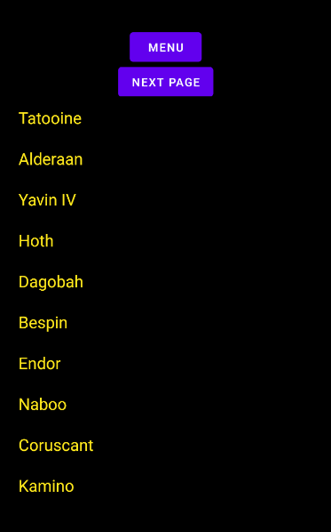
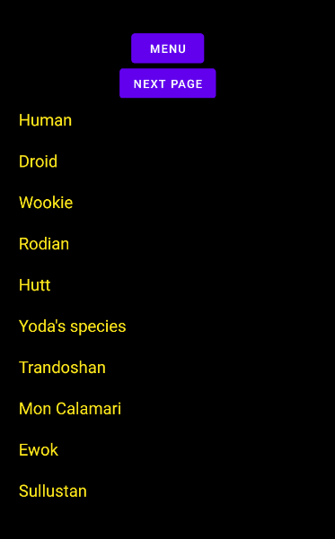
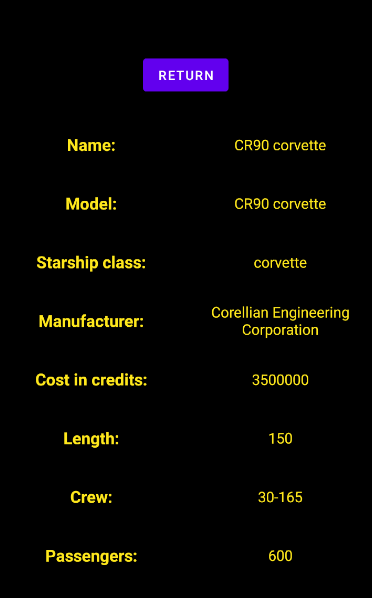

# Star Wars API

La Star Wars API (ou plus simplement SWAPI) est une API open source
permettant d'accéder à toutes les informations sur l'univers de Star Wars :

* Films
* Personnages (People)
* Planètes (Planets)
* Espèces (Species)
* Vaisseaux (Starships)
* Véhicules (Vehicles)

## En résumé

Ce projet étudiant utilise donc l'API Rest SWAPI dans l'objectif de
développer une application Android.
Chaque élément est affiché à l'aide d'une RecyclerView en suivant le modèle MVVM
recommandé par Google. Cliquer sur un élément affiche ses détails.
Les données de l'API sont stockées dans le cache de l'application
(cache temporaire de 15 minutes).
 
## L'application
 
### Menu

 
### Liste des films

 
### Détail d'un film

### Liste des personnages

 
### Détail d'un personnage

### Liste des planètes

 
### Détail d'une planète

### Liste des espèces

 
### Détail d'une espèce

### Liste des vaisseaux

 
### Détail d'un vaisseau

### Liste des véhicules

 
### Détail d'un véhicule
